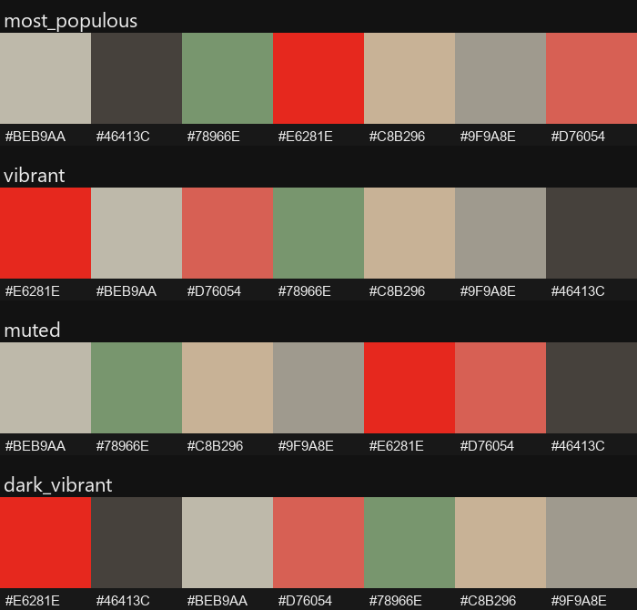
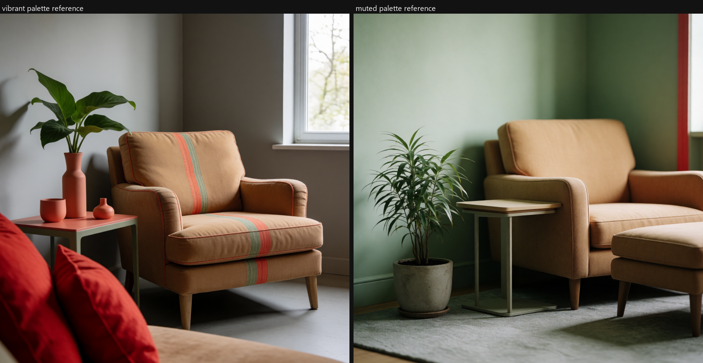

# ComfyUI Krea Palette Tools

*Pick the palette. Hand Krea a reference, not a hex-code spreadsheet.*


A ComfyUI toolkit for steering Krea 2 generations toward a specific color
palette: extract a palette from a reference image, pick how it's ranked
(dominant, vibrant, or muted), and package it as a Krea 2
`image_style_references` entry — all as composable nodes that wire into a
ComfyUI generation workflow.

## Table of Contents

- [Installation](#installation)
- [Why This Exists](#why-this-exists)
- [What it does](#what-it-does)
- [Nodes](#nodes)
- [Example workflow](#example-workflow)
- [Showcase workflows](#showcase-workflows)
- [Design notes](#design-notes)
- [Testing](#testing)
- [Sibling project](#sibling-project)
- [License](#license)

## Installation

Clone (or copy) this repository into your ComfyUI `custom_nodes/` directory
and restart ComfyUI:

```
cd ComfyUI/custom_nodes
git clone https://github.com/SurrealByDesign/ComfyUI-Krea-Palette-Tools
```

The only extra dependency is **scikit-learn** (used for k-means clustering),
which is not part of a base ComfyUI install. ComfyUI-Manager installs it
automatically from [`requirements.txt`](requirements.txt); to install it by
hand into ComfyUI's Python:

```
pip install scikit-learn
```

The package also uses `torch`, `numpy`, and `Pillow`, but those ship with
ComfyUI and are **deliberately not** listed in `requirements.txt` —
reinstalling them (torch especially) can pull a build that doesn't match
your ComfyUI/CUDA setup and break the install. After restarting, the two
nodes appear in the node menu under **`Krea/Palette`**.

`requires-python = ">=3.10"` in [`pyproject.toml`](pyproject.toml) is the
floor, not a guarantee for every ComfyUI version — open an issue if
something doesn't load on yours.

## Why This Exists

Unlike Ideogram 4, Krea 2 has no structured color-palette field in its
prompt schema — no JSON slot to drop an ordered hex array into. The
documented way to steer a Krea 2 generation toward a specific palette is
via `image_style_references`: up to 10 reference images, each with a
tunable strength (-2.0 to 2.0), that condition the output's look. That
means the "palette" Krea actually wants is an *image*, not a hex list — so
this toolkit's job is extracting a palette from a reference and rendering
it back out as a clean swatch image Krea can use as a style reference,
instead of producing JSON the way the Ideogram-facing tools do.

## What it does

Pulls a color palette out of a reference image using k-means clustering,
filters out near-duplicate colors using perceptual (Delta-E / LAB) distance
rather than raw RGB distance, and renders the result as a labeled swatch
strip — then packages that swatch image as one `image_style_references`
entry for a Krea 2 generation request.

A `mode` dropdown controls how the extracted colors are ranked: raw
frequency (`most_populous`), or vibrancy-scored against a target
saturation/lightness (`vibrant` / `light_vibrant` / `dark_vibrant` /
`muted` / `light_muted` / `dark_muted` — Android Palette API-style), so a
small but striking accent color doesn't get buried under a dull dominant
background when that's not what you want:



The extracted palette can drive a real Krea 2 generation two ways:

- **Cloud (paid):** wire the swatch image into the `Krea 2 Style Reference` →
  `Krea 2 Image` Comfy Partner Nodes (`image_style_references`-equivalent,
  metered per generation) — see [Example workflow](#example-workflow) below.
- **Local (free):** translate the extracted hex colors into a text clause
  appended to your prompt, and run your existing local Krea 2 Turbo
  checkpoint. Holding the seed and the rest of the prompt fixed, only the
  color clause changes between the two renders below:



## Nodes

### Krea Palette Extractor (`KreaPaletteExtractor`)
Takes a reference image, runs k-means clustering, removes near-duplicate
colors with Delta-E filtering, and returns colors ordered per the selected
`mode`.

- **Inputs:** `image`, `num_colors` (2-16, default 8), `min_delta_e` (default 10.0), `mode` (`most_populous` / `vibrant` / `light_vibrant` / `dark_vibrant` / `muted` / `light_muted` / `dark_muted`, default `most_populous`)
- **Outputs:** `palette_json` (hex array string, ordered per mode), `palette_preview` (swatch strip image), `color_count`

### Krea Palette Style Reference (`KreaPaletteStyleReference`)
Wraps a palette swatch image and a strength value into the payload shape
for one Krea 2 `image_style_references` entry. Does not upload the image
or call the Krea API itself — pair it with an HTTP/upload node that hosts
the swatch image and merges in the resulting `imageUrl`.

- **Inputs:** `palette_preview` (typically from `KreaPaletteExtractor`), `strength` (-2.0 to 2.0, default 1.0 — negative repels from the reference style)
- **Outputs:** `style_reference_image` (pass-through IMAGE for an upload node), `style_reference_json` (`{"strength": <float>}`, to merge with the hosted `imageUrl`)

## Example workflow

[`workflows/palette_reference_workflow.json`](workflows/palette_reference_workflow.json)
demonstrates the minimal pipeline:

```
LoadImage -> KreaPaletteExtractor
```

Load it via ComfyUI's **Workflow → Open** menu and point `LoadImage` at your
own reference. `palette_preview` is the swatch-strip image; wire it into
`KreaPaletteStyleReference` to package it for Krea 2's
`image_style_references`:

```
LoadImage -> KreaPaletteExtractor (mode=vibrant) -> KreaPaletteStyleReference (strength=1.0)
                                              \-> PreviewImage (swatch strip)
```

`KreaPaletteStyleReference`'s `style_reference_image` output still needs to
reach Krea as a hosted URL — wire it into whatever upload/HTTP node your
Krea integration uses, merge the resulting `imageUrl` into
`style_reference_json`, and add that as one entry of the request's
`image_style_references` array.

## Showcase workflows

A set of ready-to-load workflows under [`workflows/`](workflows/), beyond
the minimal example above. Load any of them via ComfyUI's
**Workflow → Open** menu and point the `LoadImage` node(s) at your own
reference.

| Workflow | What it shows | Nodes wired together |
| --- | --- | --- |
| [`showcase_01_palette_to_style_reference.json`](workflows/showcase_01_palette_to_style_reference.json) | The flagship chain: a reference image becomes a Krea-ready style-reference payload (swatch image + strength JSON). | Extractor → Style Reference |
| [`showcase_02_mode_comparison.json`](workflows/showcase_02_mode_comparison.json) | Same image, four rankings side by side — `most_populous` / `vibrant` / `muted` / `dark_vibrant` — for picking a mode before committing to one. | 4× Extractor → 4× PreviewImage |
| [`showcase_03_positive_vs_negative_strength.json`](workflows/showcase_03_positive_vs_negative_strength.json) | One extracted palette fed into two Style Reference nodes at `strength=1.5` and `strength=-1.5`, to compare pulling toward vs. repelling from a palette. | Extractor → 2× Style Reference |

**Text-display nodes are optional.** Where a workflow shows a raw JSON
string it uses `ShowText|pysssss` (from
[ComfyUI-Custom-Scripts](https://github.com/pythongosssss/ComfyUI-Custom-Scripts)).
These are clearly marked and can be deleted or swapped for any
STRING-display node — the core pipeline runs without them. All swatch
previews use the stock `PreviewImage` node.

## Design notes

- **Delta-E, not RGB distance.** Two colors that are mathematically close
  in RGB can look wildly different to the eye (and vice versa). All
  deduplication uses CIE76 Delta-E in LAB space (see
  [`utils/color_utils.py`](utils/color_utils.py)).
- **Fails gracefully.** Extraction falls back to a flat gray (`#808080`)
  swatch on a bad or degenerate image (single color, tiny image, parse
  errors) rather than crashing the workflow.
- **Image, not JSON, is the interchange format.** Krea 2's
  `image_style_references` takes a hosted image URL, not a hex list — so
  unlike the Ideogram-facing tools in the sibling project, there's no
  "palette -> JSON schema" node here. The swatch-strip image *is* the
  payload.

## Testing

Run the test suite from the package root:

```
pytest
```

or run either test file directly:

```
python tests/test_palette_extractor.py        # mode dropdown ranking, dedup, fallbacks
python tests/test_palette_style_reference.py  # strength payload shape, pass-through image
python tests/test_workflows.py                 # workflow JSONs match node signatures, no dangling links
```

## Sibling project

[ComfyUI-Ideogram-Palette-and-Prompt-Tools](https://github.com/SurrealByDesign/ComfyUI-Ideogram-Palette-and-Prompt-Tools)
covers the same palette-extraction problem for Ideogram 4's structured
prompt JSON. The k-means/Delta-E/LAB color-math core here was forked from
that repo's `utils/` and is currently maintained independently in each.

## License

Released under the [MIT License](LICENSE).
